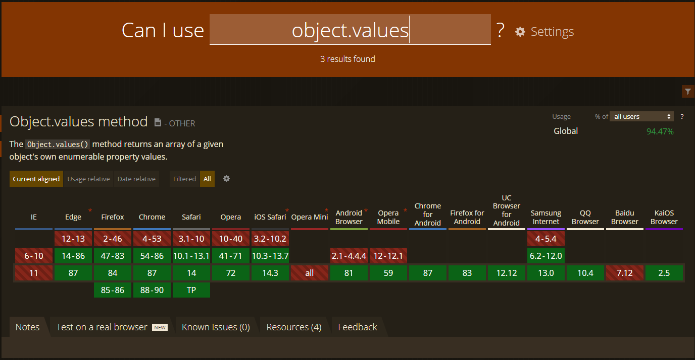

# Ramda

* Små, unit-agtige funktioner som kan kombineres, lige som de andre libs
* Immutable og og uden bivirkninger, lige som de andre libs

`R.values()` er ækvivalent til `Object.values()`


Desuden:
* Parameter-rækkefølge: data der skal behandles kommer sidst
* Funktioner er _curried_

```javascript
const a = [1, 2, 3];
const square = x => x * x;

// Built-in:
a.map(square);

// Lodash:
_.map(a, square);

// Ramda:
R.map(square, a);
```
